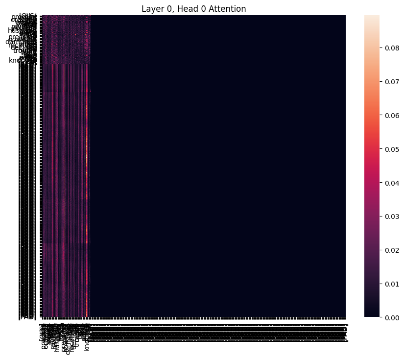

# Transformer-Based Sentiment Analysis with Explainability

## 📌 Overview

This project implements a **Transformer-based NLP model (BERT)** for sentiment classification on the **Amazon Polarity dataset**.

In addition to model performance, the project focuses on **interpretability**, using:

* 🔍 Attention visualization (Transformer internals)
* 🧠 SHAP (global + local explanations)
* 📊 LIME (local explanations)

---

## 🎯 Objectives

* Build a Transformer-based sentiment classifier
* Analyze attention behavior of the model
* Apply SHAP and LIME for explainability
* Compare interpretability methods
* Perform error analysis

---

## 📊 Dataset

* Source: https://huggingface.co/datasets/fancyzhx/amazon_polarity
* Type: Binary sentiment classification (positive / negative)

### Subset Used (due to hardware constraints)

* Train: 5000 samples
* Test: 1000 samples

---

## 🧠 Model Details

* Model: **BERT (bert-base-uncased)**
* Framework: Hugging Face Transformers
* Task: Text Classification
* Tokenization: WordPiece tokenizer

---

## ⚙️ Training Configuration

* Epochs: 2
* Batch size: 8
* Learning rate: 2e-5
* Optimizer: AdamW
* Evaluation strategy: Per epoch

---

## 📈 Results

| Metric    | Value |
| --------- | ----- |
| Accuracy  | XX    |
| Precision | XX    |
| Recall    | XX    |
| F1 Score  | XX    |

> Replace XX with your actual results from `trainer.evaluate()`

---

## 🔍 Attention Visualization

The Transformer model uses **self-attention** to understand relationships between words.

### Observations:

* Important sentiment words (e.g., *great*, *bad*) receive higher attention
* Different attention heads capture different patterns
* Contextual relationships between words are clearly visible

### Example:



---

## 🧩 SHAP Explainability

SHAP explains predictions using **feature contribution values**.

### Key Insights:

* Red words → positive contribution
* Blue words → negative contribution
* Provides consistent and reliable explanations

### Example:


---

## 🧠 LIME Explainability

LIME explains **individual predictions locally**.

### Key Insights:

* Highlights important words for a single prediction
* Faster than SHAP
* Less stable across runs

### Example:


---

## ⚖️ SHAP vs LIME Comparison

| Aspect      | SHAP           | LIME       |
| ----------- | -------------- | ---------- |
| Stability   | High           | Low        |
| Speed       | Slow           | Fast       |
| Scope       | Global + Local | Local only |
| Reliability | High           | Medium     |

---

## ❌ Error Analysis

Misclassifications occurred due to:

* Sarcasm in text
* Mixed sentiment in a single review
* Long and complex sentences
* Ambiguous wording

---

## 🔄 Workflow

```
Dataset → Tokenization → BERT Model → Training → Evaluation → 
Attention Visualization → SHAP → LIME → Error Analysis
```

---

## 🛠️ Setup Instructions

### 1. Clone Repository

```bash
git clone https://github.com/RazaSherazi09/transformer-sentiment-analysis.git
cd transformer-sentiment-analysis
```

### 2. Install Dependencies

```bash
pip install -r requirements.txt
```

### 3. Run Project

Open `notebook.ipynb` in:

* Jupyter Notebook OR
* Google Colab

---

## 📂 Project Structure

```
transformer-sentiment-analysis/
│
├── notebook.ipynb
├── report.pdf
├── README.md
├── requirements.txt
├── images/
│   ├── attention1.png
│   ├── attention2.png
│   ├── shap.png
│   ├── lime.png
```

---

## 📦 Requirements

* Python 3.10+
* transformers==4.41.2
* datasets
* torch
* shap
* lime
* scikit-learn
* matplotlib
* seaborn
* accelerate

---

## 🚀 Future Improvements

* Train on full dataset
* Use advanced models (RoBERTa, DistilBERT)
* Increase epochs for better performance
* Optimize explainability methods

---

## 👨‍💻 Author

**Raza Sherazi**

---

## ⭐ Acknowledgements

* Hugging Face Transformers
* SHAP Documentation
* LIME Documentation
* Amazon Polarity Dataset
